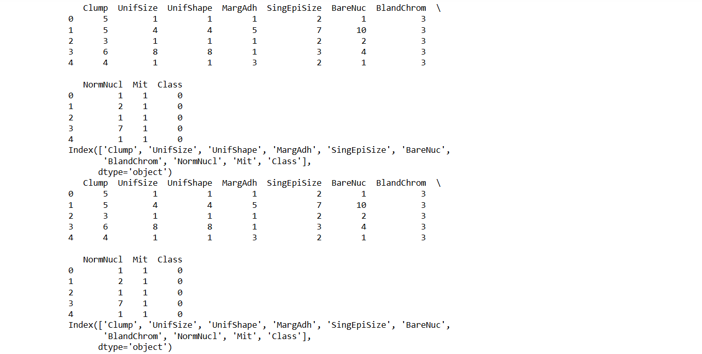
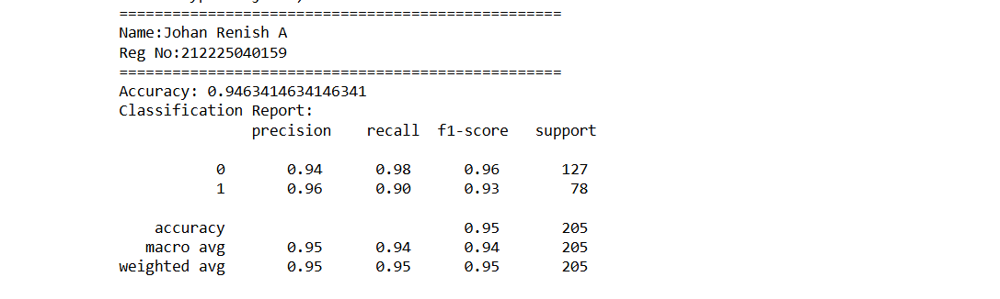
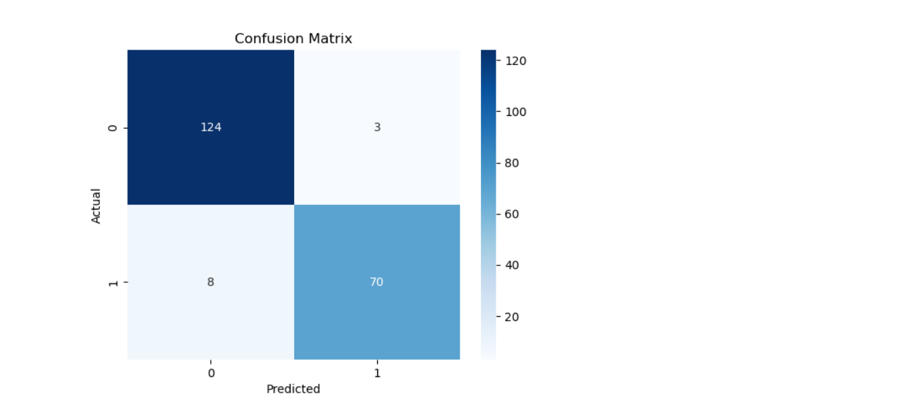

# BLENDED_LEARNING
# Implementation of Decision Tree Model for Tumor Classification

## AIM:
To implement and evaluate a Decision Tree model to classify tumors as benign or malignant using a dataset of lab test results.

## Equipments Required:
1. Hardware – PCs
2. Anaconda – Python 3.7 Installation / Jupyter notebook

## Algorithm
1. Load the tumor dataset using pandas.
2.Display the dataset structure and column names.
3.Separate features (X) and target variable (Class).
4.Split the dataset into training and testing sets.
5.Initialize the Decision Tree Classifier model.
6.Train the model using the training data.
7.Predict the class labels using test data.
8.Calculate accuracy of the model.
9.Generate classification report and confusion matrix.
10.Visualize results using a heatmap.
## Program:
```
/*
Program to  implement a Decision Tree model for tumor classification.
Developed by:Johan Renish A
RegisterNumber:212225040159  
*/
import pandas as pd
from sklearn.model_selection import train_test_split
from sklearn.tree import DecisionTreeClassifier
from sklearn.metrics import accuracy_score, classification_report, confusion_matrix
import seaborn as sns
import matplotlib.pyplot as plt
data = pd.read_csv("tumor.csv")
print(data.head())
print(data.columns)
print(data.head())
print(data.columns)
X = data.drop(columns=['Class']) 
y = data['Class']
X_train, X_test, y_train, y_test = train_test_split(X, y, test_size=0.3, random_state=42)
model = DecisionTreeClassifier(random_state=42)
model.fit(X_train, y_train)
y_pred = model.predict(X_test)
accuracy = accuracy_score(y_test, y_pred)
print("="*50)
print("Name:Johan Renish A")
print("Reg No:212225040159")
print("="*50)
print("Accuracy:", accuracy)
print("Classification Report:\n", classification_report(y_test, y_pred))
conf_matrix = confusion_matrix(y_test, y_pred)
sns.heatmap(conf_matrix, annot=True, fmt="d", cmap="Blues")
plt.xlabel("Predicted")
plt.ylabel("Actual")
plt.title("Confusion Matrix")
plt.show()
```

## Output:
 
 

## Result:
Thus, the Decision Tree model was successfully implemented to classify tumors as benign or malignant, and the model’s performance was evaluated.
